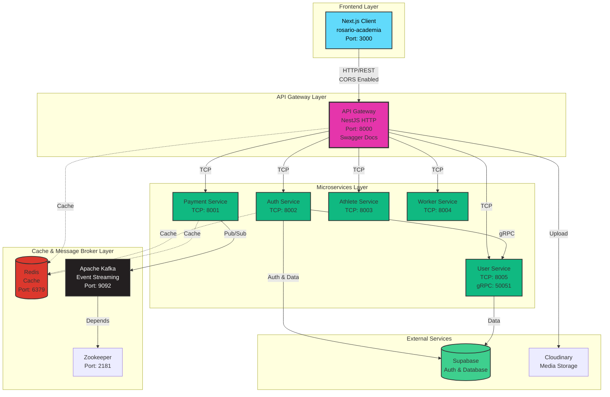
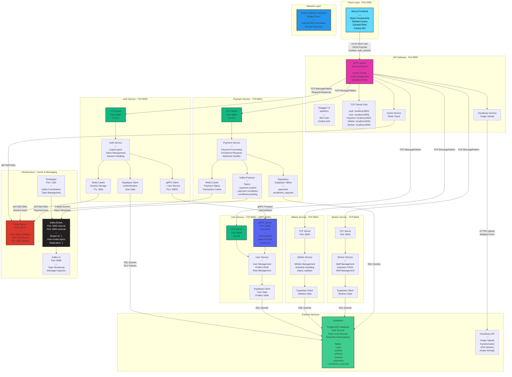

# Arquitectura del Sistema - Rosario Academia

## 📊 Diagrama de Alto Nivel



---

## 🔧 Diagrama de Bajo Nivel (Detallado)



---

## 📋 Descripción de Componentes

### 🎨 Frontend (Next.js - Port 3000)
- **Framework**: Next.js 14+ con App Router
- **State Management**: 
  - TanStack Query para server state
  - Zustand para client state
  - Context API para autenticación
- **Comunicación**: HTTP REST API con el Gateway
- **Autenticación**: Cookies HTTP-only (auth_session)
- **Features**: 
  - Dashboard de atletas
  - Gestión de pagos
  - Perfiles de usuarios
  - Sistema de roles (RBAC)

### 🌐 API Gateway (Port 8000)
- **Función**: Punto de entrada único para el frontend
- **Protocolo Externo**: HTTP/REST
- **Protocolo Interno**: TCP con MessagePattern
- **Responsabilidades**:
  - Enrutamiento de peticiones a microservicios
  - Validación de DTOs con class-validator
  - Manejo de CORS
  - Gestión de sesiones con cookies
  - Documentación Swagger en /api/docs
  - Upload de imágenes a Cloudinary
  - Cache con Redis
- **Seguridad**:
  - JWT Bearer token
  - Cookie authentication
  - Guards y decoradores para roles
  - Exception filters

### 🔐 Auth Service (TCP: 8002)
- **Protocolo**: TCP Server
- **Comunicación Externa**: gRPC Client hacia User Service
- **Responsabilidades**:
  - Autenticación de usuarios (login/logout)
  - Generación y validación de JWT
  - Gestión de sesiones con Redis
  - Integración con Supabase Auth
  - Estrategias de autenticación (JWT)
- **Cache**: Redis para sesiones con TTL configurable
- **Base de Datos**: Supabase para usuarios

### 👤 User Service (TCP: 8005 + gRPC: 50051)
- **Protocolos**: 
  - TCP Server para el Gateway
  - gRPC Server para Auth Service
- **Proto File**: user.proto con servicios:
  - GetUserById
  - GetUserProfile
  - CreateUser
  - UpdateUser
- **Responsabilidades**:
  - CRUD de usuarios
  - Gestión de perfiles
  - Manejo de roles y permisos
- **Base de Datos**: Supabase (tablas: users, profiles)

### 💳 Payment Service (TCP: 8001)
- **Protocolo**: TCP Server
- **Responsabilidades**:
  - Procesamiento de pagos
  - Gestión de solicitudes de matrícula
  - Webhooks de pasarelas de pago
  - Emisión de eventos a Kafka
- **Eventos Kafka**:
  - payment.created
  - payment.completed
  - enrollment.pending
- **Cache**: Redis para estados de pago
- **Base de Datos**: Supabase (tablas: payments, enrollment_requests)

### 🏃 Athlete Service (TCP: 8003)
- **Protocolo**: TCP Server
- **Responsabilidades**:
  - Gestión de atletas
  - Horarios y cronogramas
  - Actualización de estados y niveles
  - Distribución por categorías
- **Base de Datos**: Supabase (tabla: athletes)

### 👷 Worker Service (TCP: 8004)
- **Protocolo**: TCP Server
- **Responsabilidades**:
  - Gestión de trabajadores/asistentes
  - Manejo de turnos
  - CRUD de staff
- **Base de Datos**: Supabase (tabla: workers)

### 🗄️ Redis (Port 6379)
- **Función**: Cache distribuido y almacenamiento de sesiones
- **Adapter**: Keyv Redis (@keyv/redis)
- **Persistencia**: AOF (Append Only File)
- **TTL Default**: 600 segundos (10 minutos)
- **Usado por**:
  - Gateway: Cache general
  - Auth Service: Sesiones de usuario
  - Payment Service: Estados de transacciones

### 📨 Apache Kafka (Port 9092/9093)
- **Función**: Message broker para eventos asíncronos
- **Configuración**:
  - Broker ID: 1
  - Zookeeper: zookeeper:2181
  - Auto-create topics: Enabled
  - Replication factor: 1 (dev)
- **Listeners**:
  - Internal: kafka:9092
  - External: localhost:9093
- **Topics Principales**:
  - payment.created
  - payment.completed
  - enrollment.pending
- **UI**: Kafka UI en port 8080 para monitoreo

### 🐘 Zookeeper (Port 2181)
- **Función**: Coordinación de Kafka
- **Responsabilidades**:
  - Gestión de brokers
  - Metadata de topics
  - Leader election

### 🗃️ Supabase
- **Función**: Backend as a Service
- **Servicios Utilizados**:
  - PostgreSQL Database
  - Authentication Service
  - Row Level Security (RLS)
  - Real-time Subscriptions
- **Tablas Principales**:
  - users: Usuarios del sistema
  - profiles: Perfiles extendidos
  - athletes: Atletas registrados
  - workers: Personal/asistentes
  - payments: Transacciones de pago
  - enrollment_requests: Solicitudes de matrícula

### ☁️ Cloudinary
- **Función**: Almacenamiento y transformación de imágenes
- **Usado para**:
  - Avatares de usuarios
  - Imágenes de atletas
  - Documentos adjuntos
- **Features**:
  - Upload multipart
  - Transformaciones automáticas
  - CDN global

---

## 🔄 Flujos de Datos Principales

### 1️⃣ Flujo de Autenticación
```
Client → Gateway (POST /auth/login)
  → Gateway → Auth Service (TCP)
    → Auth Service → Supabase (verify credentials)
    → Auth Service → User Service (gRPC: GetUserById)
    → Auth Service → Redis (store session)
    → Auth Service generates JWT
  ← Gateway stores cookie
← Client receives auth_session cookie
```

### 2️⃣ Flujo de Consulta de Usuario
```
Client → Gateway (GET /users/profile)
  → Gateway validates JWT
  → Gateway → User Service (TCP)
    → User Service → Supabase (query profiles)
  ← Gateway formats response
← Client receives user data
```

### 3️⃣ Flujo de Pago
```
Client → Gateway (POST /payments)
  → Gateway → Payment Service (TCP)
    → Payment Service → Supabase (insert payment)
    → Payment Service → Redis (cache payment status)
    → Payment Service → Kafka (publish payment.created event)
  ← Gateway returns payment confirmation
← Client receives payment ID
```

### 4️⃣ Flujo de Upload de Imagen
```
Client → Gateway (POST /users/avatar)
  → Gateway → Cloudinary (multipart upload)
  ← Gateway receives Cloudinary URL
  → Gateway → User Service (update profile)
← Client receives updated profile
```

---

## 🐳 Arquitectura de Contenedores

### Docker Network
- **Nombre**: backend
- **Driver**: bridge
- **DNS Interno**: Resolución automática por hostname

### Servicios Dockerizados
1. **gateway** → Expone port 8000
2. **auth-service** → Interno
3. **user-service** → Interno
4. **payment-service** → Interno
5. **athlete-service** → Interno (inferido)
6. **worker-service** → Interno (inferido)
7. **redis** → Expone port 6379
8. **kafka** → Expone ports 9092, 9093
9. **zookeeper** → Expone port 2181
10. **kafka-ui** → Expone port 8080

### Volúmenes Persistentes
- `redis_data`: Datos de Redis
- `kafka_data`: Logs y datos de Kafka
- `zookeeper_data`: Datos de Zookeeper
- `zookeeper_logs`: Logs de Zookeeper

---

## 🔒 Seguridad

### Autenticación
- JWT con secret configurable
- Cookies HTTP-only para sesiones
- Expiración de tokens: 24h

### Autorización
- Guards de roles en el Gateway
- Decoradores @Roles para endpoints
- Row Level Security en Supabase

### Validación
- DTOs con class-validator
- Whitelist enabled
- Forbidden non-whitelisted properties
- Transform enabled

---

## ⚡ Optimizaciones

### Cache Strategy
- Redis como cache layer
- TTL configurable por servicio
- Cache invalidation en mutations

### Event-Driven Architecture
- Kafka para desacoplamiento
- Async processing de pagos
- Event sourcing para auditoría

### Protocol Optimization
- TCP para comunicación interna (menor overhead que HTTP)
- gRPC para comunicación de alta frecuencia (Auth → User)
- HTTP/REST solo en el borde (Client → Gateway)

---

## 📊 Métricas y Monitoreo

### Puntos de Observabilidad
1. **Kafka UI** (port 8080): Monitoreo de eventos
2. **Swagger UI** (port 8000/api/docs): Documentación y testing
3. **Logs**: Logger de NestJS en cada servicio
4. **Exception Filters**: Captura de errores en Gateway y microservicios

---

## 🚀 Escalabilidad

### Horizontal Scaling
- Cada microservicio puede escalar independientemente
- Redis como cache compartido
- Kafka como event bus distribuido

### Load Balancing
- Gateway puede replicarse detrás de un load balancer
- Servicios internos con múltiples instancias
- Redis Cluster para alta disponibilidad (futuro)

---

## 🔧 Tecnologías Utilizadas

| Componente | Tecnología | Versión |
|------------|-----------|---------|
| Frontend | Next.js | 14+ |
| API Gateway | NestJS | Latest |
| Microservicios | NestJS | Latest |
| Cache | Redis | 7.2-alpine |
| Message Broker | Apache Kafka | 7.5.0 |
| Zookeeper | Confluent Zookeeper | 7.5.0 |
| Database | Supabase (PostgreSQL) | Latest |
| Auth | Supabase Auth + JWT | Latest |
| Media Storage | Cloudinary | API v2 |
| Container | Docker + Docker Compose | Latest |
| Protocol - Internal | TCP, gRPC | - |
| Protocol - External | HTTP/REST | - |

---

## 📝 Convenciones

### Ports
- **3000**: Frontend (Next.js)
- **8000**: API Gateway
- **8001**: Payment Service
- **8002**: Auth Service
- **8003**: Athlete Service
- **8004**: Worker Service
- **8005**: User Service (TCP)
- **50051**: User Service (gRPC)
- **6379**: Redis
- **9092/9093**: Kafka
- **2181**: Zookeeper
- **8080**: Kafka UI

### Nomenclatura
- **Microservicios**: kebab-case (auth-service, user-service)
- **Clases**: PascalCase
- **Variables**: camelCase
- **Archivos**: kebab-case
- **Constantes ENV**: UPPERCASE

### Patrones de Diseño
- Repository Pattern
- Dependency Injection
- Adapter Pattern (Cache)
- Strategy Pattern (Auth)
- Observer Pattern (Kafka events)

---

**Generado el**: 2025-10-13
**Proyecto**: Rosario Academia  
**Arquitectura**: Microservicios con API Gateway

